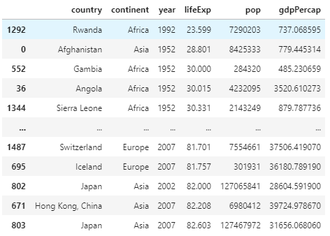

# Project 1

### Question 1
**Describe what is a package? Also, describe what is a library? What are the two steps you need to execute in order to install a package and then make that library of functions accessible to your workspace and current python work session? Provide examples of how you would execute these two steps using two of the packages we have used in class thus far. Be sure to include an alias in at least one of your two examples and explain why it is a good idea to do so.**

A package is a distribution of software in an archive file. In python, this takes the form of a collection of modules (file with functions or variables). 
A library is a collection of modules or functions that can be called from within a program
  
Steps for working with python packages/libraries:
  
  - When using PyCharm, packages can be installed by going to settings, then Python Interpreter, the (+) at the bottom left, and then adding whichever packages you would like.
  - When in the actual .py file, libraries are accessed by called using import, for example: 

`import numpy`  
`import pandas`
  
Abbreviations are commonly used to make calling the library easier such as:

`import pandas as pd`  
`pd.readtsv()`

### Question 2  
**Describe what is a data frame? Identify a library of functions that is particularly useful for working with data frames. In order to read a file in its remote location within the file system of your operating system, which command would you use? Provide an example of how to read a file and import it into your work session in order to create a new data frame. Also, describe why specifying an argument within a read_() function can be significant. Does data that is saved as a file in a different type of format require a particular argument in order for a data frame to be successfully imported? Also, provide an example that describes a data frame you created. How do you determine how many rows and columns are in a data frame? Is there an alternate terminology for describing rows and columns?**

A dataframe is a container in python what holds data in an x and y axis. Pandas is a common library to use when working with dataframes. Data can be imported into a data frame from a separated values file easily.  
For example here is our gapminder.tsv file uploaded to a data frame:  
`data = pd.read_csv('./data/gapminder.tsv', sep = '\t')`  
  
Here python is using a fuction to read a comma separated value file, however because our file is tab separated, we need to specify that with the `sep = '\t'`   
  
To check and see if the data frame was filled correctly, we can check using:  
`data.head(10)`  This will show the first 5 rows of the data

To show additional stats on the data frame use:  
`data.info()` This will provide information like no. of columns, entries, column names, etc...  

Rows and columns are also called data vectors
  

### Question 3
***Import the gapminder.tsv data set and create a new data frame. Interrogate and describe the year variable within the data frame you created. Does this variable exhibit regular intervals? If you were to add new outcomes to the raw data in order to update and make it more current, which years would you add to each subset of observations? Stretch goal: can you identify how many new outcomes in total you would be adding to your data frame?***

We can look at all of the years entered in the data frame by using this code:  
`years = data['year'].unique()`  
This will output: 
>array([1952, 1957, 1962, 1967, 1972, 1977, 1982, 1987, 1992, 1997, 2002,
       2007])   

We can see that there are 5 year intervals between each observation, thus to update the data set we would take 2012 and 2017. To update this, there would be a total of 284 new outcomes (2 years * 142 nations in the data)

### Question 4 
**Using the data frame you created by importing the gapminder.tsv data set, determine which country at what point in time had the lowest life expectancy. Conduct a cursory level investigation as to why this was the case and provide a brief explanation in support of your explanation.**

Query:  
`lowlife = data.sort_values(by = 'lifeExp')`  

This produces this new frame:   

  

As we can see Rwanda in 1992 has the lowest life expecancy, likely due to the Rwandan Civil War.

### Question 5
**Using the data frame you created by importing the gapminder.tsv data set, multiply the variable pop by the variable gdpPercap and assign the results to a newly created variable. Then subset and order from highest to lowest the results for Germany, France, Italy and Spain in 2007. Create a table that illustrates your results (you are welcome to either create a table in markdown or plot/save in PyCharm and upload the image). Stretch goal: which of the four European countries exhibited the most significant increase in total gross domestic product during the previous 5-year period (to 2007)?

Create new column:  
`data['popbygdp'] = data['pop'] * data['gdpPercap']`  
Sort by year/nation:  
`data2007 = (data['year'] == 2007)`  
`q5nations = (df2007['country'].isin(['Germany', 'France', 'Italy', 'Spain']))`  
`selection = data2007 & q5nations`    
`q5df = data[selection]` 
`q5df = q5df.sort_values(by=['popbygdp'], ascending = False)`  

![]q5gdp.png  

### Question 6  
**You have been introduced to four logical operators thus far: &, ==, | and ^. Describe each one including its purpose and function. Provide an example of how each might be used in the context of programming.

&
- AND, returns true if both objects compared are the same, was used in prior question to only return observations with correct year & country

==
- Equal, 6==6 is True, 6==5 is False

|
- OR, similarly used to &, however only one of the combined cases may be True, so either year OR country, but not both.

^
- Exlusive OR/XOR, compares the binary representation of objects and returns their combined integer. I honestly have no idea how to use this practically.
- `output = 6^3`
- output would now return 5  

### Question 7 
**Describe the difference be tween .loc and .iloc. Provide an example of how to extract a series of consecutive observations from a data frame. Stretch goal: provide an example of how to extract all observations from a series of consecutive columns.

Both of these will return the location of whatever you ask them to find.  

.loc will return the value at the searched index with the label you input
- df.loc(5) would return the row with the index with the name '5'
- Can create confusion if you have sorted an old dataframe into a new one, as index labeled '5' is no longer at index 5

.iloc will return the index at the searched value
- df.iloc(5) would return the row in at index 5, refering to a constant location.

To return a series use something like `data.iloc[4:10]`  
![]ilocex.png  

#### Describe how an api works. Provide an example of how to construct a request to a remote server in order to pull data, write it to a local file and then import it to your current work session.
#### Describe the apply() function from the pandas library. What is its purpose? Using apply) to various class objects is an alternative (potentially preferable approach) to writing what other type of command? Why do you think apply() could be a preferred approach?
#### Also describe an alternative approach to filtering the number of columns in a data frame. Instead of using .iloc, what other approach might be used to select, filter and assign a subset number of variables to a new data frame?
