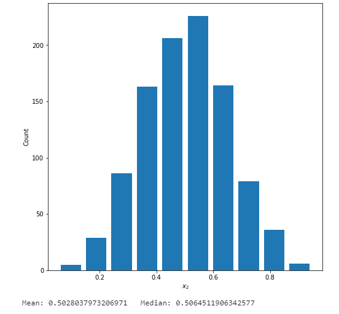
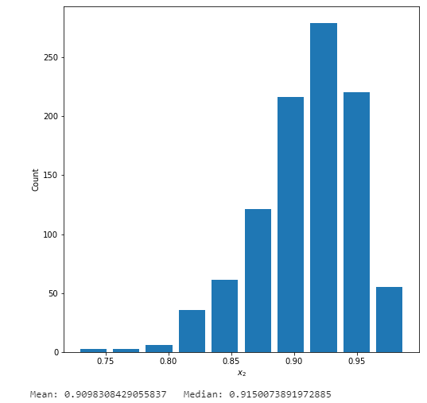
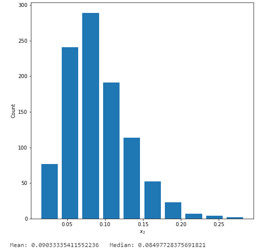

# Project 2

### Question 1
#### Describe continuous, ordinal and nominal data. Provide examples of each. Describe a model of your own construction that incorporates variables of each type of data. You are perfectly welcome to describe your model using english rather than mathematical notation if you prefer. Include hypothetical variables that represent your features and target.

Continous data: can take on any numerical value and can be broken down into parts and retain its significance (like meters to milimeters). Examples could be time in seconds, weight of an object, etc...  

Ordinal data: variables have numerical values and are ranked. Here the order of variables matters, but not the magnitudes of their differences (thus cannot be further subdivided). Examples would include a 1-5 feeling thermometer data (Not likely at all to Very likely) or education level.

Nominal data: variables represent categories that cannot be intrinsically ordered and do not have value. Examples would include favorite type of hat or type of dog.

A model that would include all of these data types is measuring the fuel efficiency of cars.
- Fuel efficiency (target/dependent variable) and factors like produced horsepower would be continous
- Number of doors or type of drivetrain (4WD, AWD, Front and Rear wheel drive) would be ordinal
- Body type (sedan, SUV, coupe) or manufacturer would be nominal  

### Question 2
#### Symmetric Data
  
- In the beta distrobution the alpha and beta parameters are both equal, which gives you a mean and median value of around the 50th percentile
#### Left Skewed Data
   
- Here the alpha value is 50.0 and the beta is 5.0, which makes the data left tailed (the mean is less than the median)
#### Right Skewed Data
   
- Here the alpha value is 5.0 and the beta is 50.0, which makes the data right tailed (the mean is greater than the median)


### Question 3
####  Which of the two resulting plots best communicates the change in life expectancy amongst all of these countries from 1952 to 2007?

Below are two histograms representing life expectancy by number of nations from the years 1952 and 2007 from our gampminder dataset.


```
min_year = df['year'].min()
max_year = df['year'].max()
min_pop = df['lifeExp'].min()
max_pop = df['lifeExp'].max()
n_bins = 10
my_bins = np.linspace(min_pop, max_pop, n_bins + 1)
my_bins2 = np.linspace(np.log10(min_pop), np.log10(max_pop), n_bins + 1)
idx_min_year = df['year'] == min_year
idx_max_year = df['year'] == max_year
df_min_year = df[idx_min_year]
df_max_year = df[idx_max_year]

#Create histogram
plt.figure(figsize=(8,8))
plt.hist(df_min_year['lifeExp'], rwidth = 0.85, label = 1952, bins = my_bins, alpha = 0.5, color = 'firebrick')
plt.hist(df_max_year['lifeExp'], rwidth = 0.85, label = 1952, bins = my_bins, alpha = 0.5, color = 'steelblue')
plt.xlabel("Life Expectancy", fontsize = 16)
plt.ylabel("Number of countries", fontsize = 16)
plt.legend(loc = 'upper left', fontsize = 16)
plt.savefig('LifeExpHist1.png', bbox_inches='tight')
plt.show()
```


```
#Create histogram with a logarithmic transformation

plt.figure(figsize=(8,8))
plt.hist(np.log10(df_min_year['lifeExp']), rwidth = 0.85, label = 1952, bins = my_bins, alpha = 0.5, color = 'firebrick')
plt.hist(np.log10(df_max_year['lifeExp']), rwidth = 0.85, label = 1952, bins = my_bins, alpha = 0.5, color = 'steelblue')
plt.xlabel("$\log_{10} Life Expectancy$", fontsize = 16)
plt.ylabel("Number of countries", fontsize = 16)
plt.legend(loc = 'upper left', fontsize = 16)
plt.savefig('LifeExpHist2.png', bbox_inches='tight')
plt.show()
```

Here we can see both charts show similar information. I personally prefer the original, non-transformed, chart. This is because we do not loose the quantitative data on the X-axis, as the years are still present. This data doe not contain a large tail or outliers, and thus I do not see an added benefit of a logarithmic transformation.

### Question 4
#### Which of the two resulting box and whiskers plots best communicates the change in population amongst all of these countries from 1952 to 2007?

Here we have two box and whisker plots for population by year. The unaltered one has data that is too spread out to read effectively on the Y-axis. To resolve this, the second plot has undergone a log transformation on population which visually compacts the Y-axis and allows us to make proper comparasons between each of the boxes between years.


```
#Create a box and whisker plot in SeaBorn

plt.figure(figsize=(8, 8))
sns.boxplot(x=data['year'], y=data['pop'], color='darkcyan')
plt.ylabel('Population (Billions)', fontsize = 16)
plt.xlabel('Year', fontsize = 16)
plt.savefig('PopBox1.png', bbox_inches='tight')
plt.show()
```


```
#Create a box and whisker plot in SeaBorn using a log transformation

plt.figure(figsize=(8, 8))
sns.boxplot(x=data['year'], y=np.log10(data['pop']), color='darkcyan')
plt.ylabel('$\log_{10}$ Population (Billions)', fontsize = 16)
plt.xlabel('Year', fontsize = 16)
plt.savefig('PopBox2.png', bbox_inches='tight')
plt.show()
```


